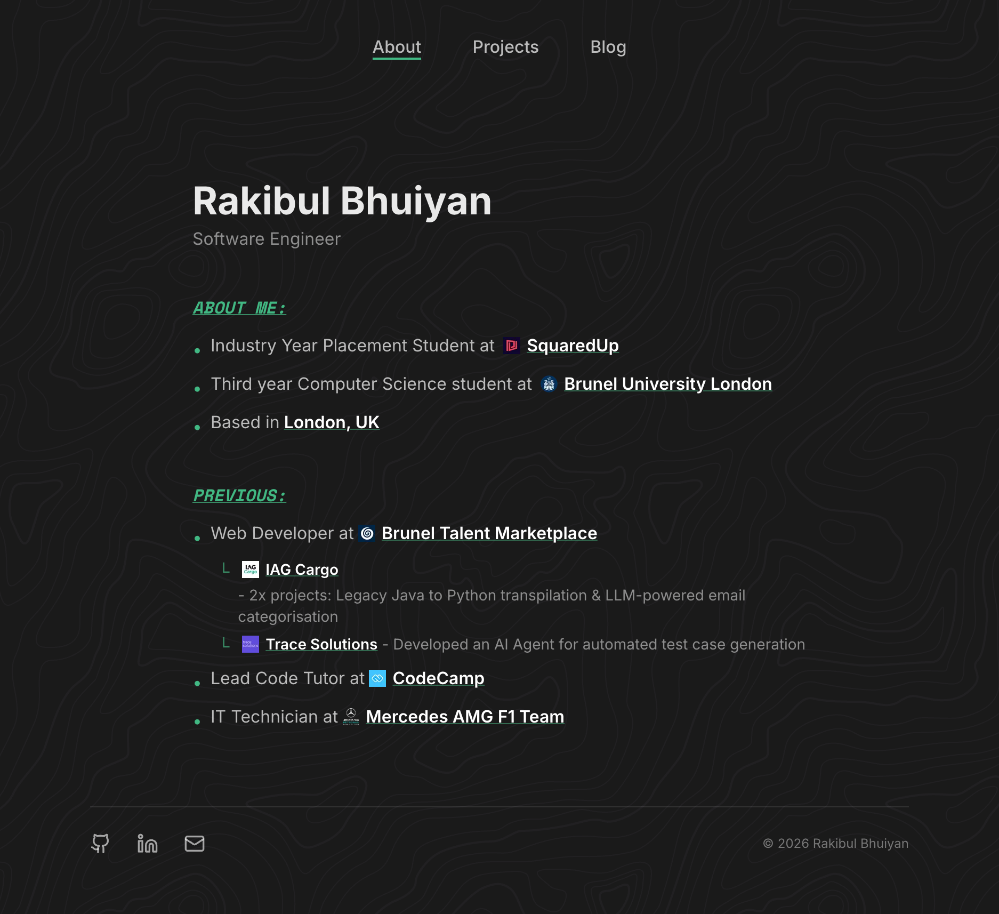

  

  # Rakibul Bhayat

  ### Software Engineer | Full-Stack Developer

  

    A modern portfolio showcasing my projects, skills, and professional experience in software engineering.
  

  
  
  
  

---

## Overview

  

A clean, responsive portfolio built with modern web technologies. Features a minimalist design with smooth animations, project showcases, and a searchable projects section.

## Tech Stack

- **Framework:** Next.js 16.1.1 (App Router)
- **UI:** React 19, TypeScript, Tailwind CSS
- **Animations:** Framer Motion
- **Testing:** Vitest, React Testing Library
- **CI/CD:** GitHub Actions, Husky
- **Deployment:** Vercel

## Features

- Responsive design optimized for all devices
- Searchable projects with technology filtering
- Dynamic technology badges with Devicon integration
- Smooth page transitions and animations
- Comprehensive test coverage with automated testing

## Connect

Feel free to reach out or explore my work:

- **Portfolio:** [rakibulb.dev](https://www.rakibulb.dev)
- **LinkedIn:** [rakibulb](https://www.linkedin.com/in/rakibulb)
- **GitHub:** [rakibulbh](https://github.com/rakibulbh)
- **X:** [rakibulb](https://x.com/rakibulb)

---

  Built with Next.js and deployed on Vercel

